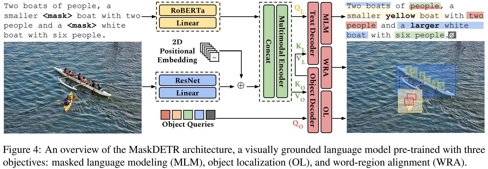

# World-to-Words: Grounded Open Vocabulary Acquisition through Fast Mapping in Vision-Language Models (ACL 2023)

**SLED Lab @ University of Michigan**

[Model Demo](https://huggingface.co/spaces/sled-umich/OctoBERT-flickr-demo) • [Dataset]() • [Paper](https://arxiv.org/abs/2306.08685)

[Ziqiao Ma](https://mars-tin.github.io/)\*, [Jiayi Pan](https://www.jiayipan.me/)\*, [Joyce Chai](https://web.eecs.umich.edu/~chaijy/) (\* denotes equal contribution)



## Getting Started

You can play with object-oriented BERT (octoBERT) through [HuggingFace Space](https://huggingface.co/spaces/sled-umich/OctoBERT-flickr-demo) or [Colab](https://colab.research.google.com/drive/1kF-sKoTeXYrNY5bqKGGVcbzqCzOKOjGw#scrollTo=0HxfK6WKe_2P).


Our Grounded Open Vocabulary Acquisition (GOVA) dataset is available on [HuggingFace Dataset](https://huggingface.co/datasets/zma/refcloze).

If you are interested in reproducing our project, please follow the instructions below, which will guide you through the installation, pre-training, inference and evaluation stages.

### Installation

Clone our repository and create the python environment, you can install the required packages by 

```bash
# either
pip install -r requirements.txt
# or after you install pytorch
pip install tqdm transformers timm wandb prettytable spacy pycocotools einops scipy
```

### Inference

We release the pre-trained model. You can run the model simply by

```python
import torch
model, img_transform, tokenizer, post_processor, plot_results = torch.hub.load('Jiayi-Pan/RefCloze_Pub', 'flickr_base_model')
```
or access the weights [here](https://huggingface.co/sled-umich/OctoBERT-flickr/blob/main/plain_model.pth).

Please follow the instructions in [demo.ipynb](demo.ipynb) to play with our model.

### Pre-training
If you are interested in training the model yourself, please follow the instructions in [Pre-training Instructions](scripts/pretrain/README.md).


### Training Trajectory

For analysis purpose, we will release the training trajectory of our model, which are a series of checkpoints during the training process. 

### Evaluation

We will release the evaluation code soon.

## Citation

If you find our work useful, please give us a star and cite as follows :)

```bibtex
@misc{ma2023worldtowords,
      title={World-to-Words: Grounded Open Vocabulary Acquisition through Fast Mapping in Vision-Language Models}, 
      author={Ziqiao Ma and Jiayi Pan and Joyce Chai},
      year={2023},
      eprint={2306.08685},
      archivePrefix={arXiv},
      primaryClass={cs.CL}
}
```

## Acknowledgement

Our project is built upon [MDETR](https://github.com/ashkamath/mdetr), [DETR](https://github.com/facebookresearch/detr) and many others. We thank the authors for their great work!

## License

The project is released under the Apache 2.0 license. Please see the [LICENSE](LICENSE) file for more information.
